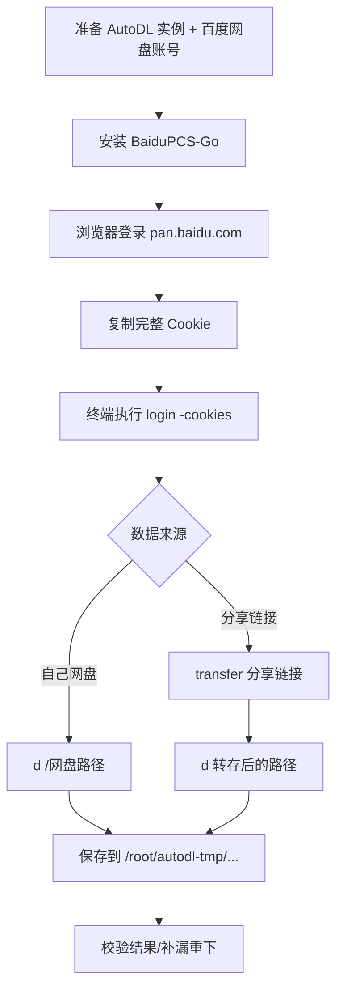
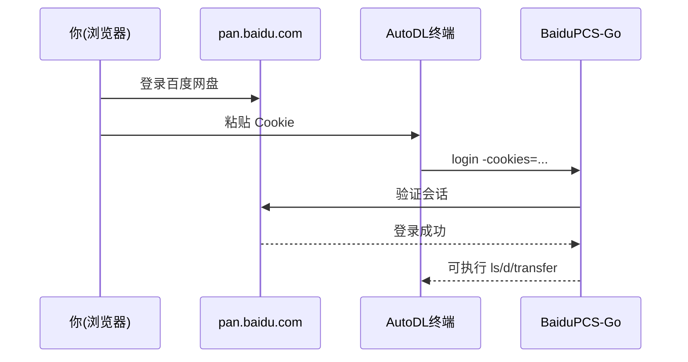

# AutoDL 命令行直下百度网盘（BaiduPCS-Go）操作手册

> 目标：把百度网盘数据直接下载到本机（AutoDL 实例）  
> 场景：不走 AutoPanel 挂载，全程命令行  
> 更新时间：2026-02-19（按当日可用版本整理）

## 0) 一图看懂





## 1) 快速执行清单（复制即用）

建议先开 `tmux`，避免 SSH 断线导致下载中断。

```bash
tmux new -s pan
```

### 1.1 安装 BaiduPCS-Go（Linux amd64）

```bash
set -e
cd /root/autodl-tmp
apt-get update && apt-get install -y unzip
wget -O BaiduPCS-Go-v4.0.0-linux-amd64.zip \
  https://github.com/qjfoidnh/BaiduPCS-Go/releases/download/v4.0.0/BaiduPCS-Go-v4.0.0-linux-amd64.zip
unzip -o BaiduPCS-Go-v4.0.0-linux-amd64.zip
chmod +x /root/autodl-tmp/BaiduPCS-Go-v4.0.0-linux-amd64/BaiduPCS-Go
ln -sf /root/autodl-tmp/BaiduPCS-Go-v4.0.0-linux-amd64/BaiduPCS-Go /usr/local/bin/BaiduPCS-Go
BaiduPCS-Go version
```

### 1.2 设置下载目录 + 并发参数（SVIP 推荐起点）

```bash
mkdir -p /root/autodl-tmp/baidu_dl
BaiduPCS-Go config set -savedir /root/autodl-tmp/baidu_dl
BaiduPCS-Go config set -max_parallel 15 -max_download_load 2
```

说明：作者 README 对 SVIP 建议 `max_parallel` 10~20、`max_download_load` 1~2，通常更稳。

### 1.3 登录（推荐 Cookie 登录）

1. 在本地浏览器登录 `https://pan.baidu.com`
2. 打开 F12 -> Network -> 任意请求
3. 复制 `Request Headers` 里的完整 `Cookie`（至少要有 `BDUSS`、`STOKEN`）
4. 粘贴到 AutoDL 终端执行：

```bash
read -rsp "Paste pan.baidu.com Cookie: " PAN_COOKIE; echo
BaiduPCS-Go login -cookies="$PAN_COOKIE"
unset PAN_COOKIE
BaiduPCS-Go who
```

> 备选登录：  
> `BaiduPCS-Go login -bduss="<BDUSS>" -stoken="<STOKEN>"`

## 2) 下载操作

### 2.1 下载你自己网盘里的数据

```bash
BaiduPCS-Go quota
BaiduPCS-Go ls /
BaiduPCS-Go search -path=/ -r 关键词
BaiduPCS-Go d "/你的网盘路径/目录或文件" --saveto /root/autodl-tmp/baidu_dl --status
```

常用参数：

- `--status`：输出线程状态，便于观察速度
- `--ow`：覆盖本地同名文件
- `--mode pcs`：若默认 `locate` 模式报 `user is not authorized` 可切换
- `--fullpath`：按网盘完整路径落地

### 2.2 下载他人分享链接（先转存再下载）

```bash
BaiduPCS-Go transfer "https://pan.baidu.com/s/xxxx?pwd=abcd"
# 转存到当前网盘目录后，再下载对应路径
BaiduPCS-Go d "/转存后的路径" --saveto /root/autodl-tmp/baidu_dl --status
```

## 3) 常见坑和避坑建议

1. Cookie 过期/失效：重新从 `pan.baidu.com` 复制最新 Cookie 再 `login`。
2. 速度异常慢：先降低并发，尝试：
   - `BaiduPCS-Go config set -max_parallel 10 -max_download_load 1`
3. 报 `user is not authorized`：下载时加 `--mode pcs`。
4. 路径有空格或中文：一定用引号包裹路径。
5. 大任务建议全程 `tmux`，避免会话断开。

## 4) 给新开的 Codex 的最小执行模板

```bash
# 0. 环境
tmux new -s pan
mkdir -p /root/autodl-tmp/baidu_dl && cd /root/autodl-tmp

# 1. 安装
wget -O BaiduPCS-Go.zip https://github.com/qjfoidnh/BaiduPCS-Go/releases/download/v4.0.0/BaiduPCS-Go-v4.0.0-linux-amd64.zip
unzip -o BaiduPCS-Go.zip
chmod +x BaiduPCS-Go-v4.0.0-linux-amd64/BaiduPCS-Go
ln -sf /root/autodl-tmp/BaiduPCS-Go-v4.0.0-linux-amd64/BaiduPCS-Go /usr/local/bin/BaiduPCS-Go

# 2. 配置
BaiduPCS-Go config set -savedir /root/autodl-tmp/baidu_dl -max_parallel 15 -max_download_load 2

# 3. 登录（手动粘贴 Cookie）
read -rsp "Paste pan.baidu.com Cookie: " PAN_COOKIE; echo
BaiduPCS-Go login -cookies="$PAN_COOKIE"
unset PAN_COOKIE

# 4. 下载
BaiduPCS-Go d "/你的网盘路径/目录或文件" --saveto /root/autodl-tmp/baidu_dl --status
```

## 5) 参考链接

- AutoDL 网盘文档：https://www.autodl.com/docs/netdisk/
- BaiduPCS-Go 仓库：https://github.com/qjfoidnh/BaiduPCS-Go
- BaiduPCS-Go Releases：https://github.com/qjfoidnh/BaiduPCS-Go/releases
- BaiduPCS-Py（备选）：https://github.com/PeterDing/BaiduPCS-Py
- bypy（仅 `/apps/bypy` 目录，备选）：https://github.com/houtianze/bypy
