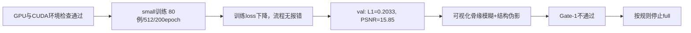
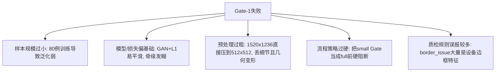
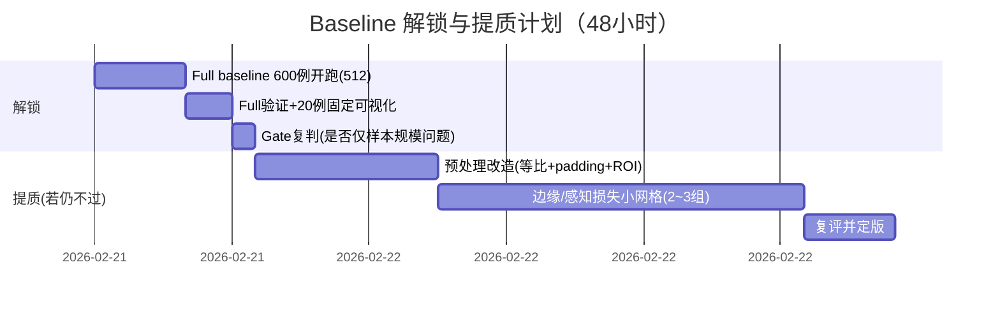

# 阶段2失败复盘与下一步总计划（教师指挥官版）

> 更新时间：2026-02-21  
> 结论先行：**不是环境问题，是“small策略+方法配置”导致 Gate-1 卡住。**

---

## 1) 当前战况（一眼看懂）

### 关键证据（已核验）
- 环境通过：`/root/autodl-tmp/X/CodexDev/Execution_X_P1P2/docs/env_gpu_check.md`
- 阶段2报告：`/root/autodl-tmp/X/CodexDev/Execution_X_P1P2/docs/stage2_execution_report.md`
- small 指标：`/root/autodl-tmp/X/CodexDev/Execution_X_P1P2/outputs/metrics/small_val_metrics.json`
  - `mean_l1=0.203312`
  - `mean_psnr=15.852553`
- small 可视化：`/root/autodl-tmp/X/CodexDev/Execution_X_P1P2/outputs/viz/small/small_viz_grid_20.png`
- 失败统计：`/root/autodl-tmp/X/CodexDev/Execution_X_P1P2/outputs/metrics/small_failure_stats.json`
  - 失败样本 `25/80`

---

## 2) 这次“卡住”的本质是什么？

### 2.1 不是环境故障
- 已确认 `Python 3.12.3 + torch 2.3.0+cu121 + CUDA available + vGPU-32GB` 正常。
- 这次失败与“找不到虚拟环境/缺CUDA”无关。

### 2.2 是“可训练”但“不可用”
- 训练流程是通的，loss 下降明显；
- 但业务目标是“可描点可测量”，small 结果在关键骨缘上仍明显不达标。

### 2.3 small 阶段出现明显泛化差
- small 训练末段 `loss_G_L1≈3.84`（对应训练域 L1 约 `0.038`）；
- 验证集 `mean_l1=0.203`，约为训练末段的 **4.9 倍**；
- 这说明 small（80例）更像“过拟合演示”，不是可靠质量结论。

---

## 3) 根因分析（按可信度排序）

### A. 样本规模导致泛化弱（高可信）
- small 仅 80 例，任务又是“RGB侧貌 -> X线骨结构”高难跨模态，天然信息缺失。
- 在这种任务上，用 small 做“是否能进 full”的硬判定，风险偏大。

### B. 目标函数偏平滑（高可信）
- 当前核心是 GAN + L1，常见现象就是“结构对了大概轮廓，但骨缘细节发糊”。
- 对“描点”目标来说，仅这套损失通常不够。

### C. 预处理策略损失信息（中高可信）
- 代码当前把图像直接 resize 到正方形 512：`1520x1236 -> 512x512`。
- 会带来比例压缩 + 高频细节损失，不利于下颌缘/牙槽区精细结构保持。

### D. 流程策略问题（高可信）
- 你当前规则是“small Gate 不过 -> 禁止 full”，这会把“探索阶段”变成“终审阶段”。
- 在该任务里更合理是：small 用于验证流程与方向，full 才做实质质量判断。

### E. 质检误报混入决策（中可信）
- `border_issue=326` 很大概率含大量正常X线边框/标尺，不应直接当剔除依据。
- 失败样本与异常标签交叉比例不高（例如 orientation 仅 3/25），说明主要矛盾不是“脏数据爆炸”。

---

## 4) 解决办法（先解锁，再提质）

## 4.1 先“解锁流程”而不是原地打转
1. **允许一次 full baseline（600例）直接开跑**，作为判定样本规模效应的关键实验。  
2. 若 full 后 Gate-1 仍不通过，再进入 P2.5（结构化提质迭代）。

> 解释：现在最大不确定性是“small失败是样本不足，还是方法根本不行”。不跑full就无法区分。

## 4.2 P2.5 提质动作（按优先级）
1. **预处理改造（优先级最高）**
   - 改为“保持长宽比 + padding（letterbox）”，避免强制方形压缩。
   - 加固定 ROI（头颅-下颌主区域）策略，减少无关背景占比。
2. **损失改造（第二优先）**
   - 在 GAN+L1 基础上增加边缘/梯度一致性损失（建议权重 5~10）。
   - 再尝试感知损失，并把 `lambda_l1` 从 100 网格到 80/60。
3. **训练控制（第三优先）**
   - 增加 val 驱动的 best checkpoint 保存，不只用 last。
   - 固定评估清单（同一批 20 例）做版本横向比较，避免“看图偏差”。

## 4.3 不建议立刻做的事
- 不建议直接上 768/1024（当前 512 结构都没稳，放大会放大错误）。
- 不建议按当前审计结果大规模剔样（边框类误报比例高，先人工小清单复核）。

---

## 5) 下一步执行计划（建议 48 小时）

---

## 6) 给你的“指挥口令”（避免再次卡死）

- **口令1：small 是“方向检查”，不是“终审门禁”。**  
- **口令2：先验证样本规模效应（full），再判断是否要改模型。**  
- **口令3：所有质量结论必须绑定固定评估集和固定可视化清单。**  
- **口令4：先稳 512 的结构可描点，再谈 768/1024。**

---

## 7) 当前建议决策

**建议你现在就批准执行一轮 full baseline（600例/512）**，以最快速度回答最关键问题：  
> “small失败到底是数据量问题，还是方法链路问题？”

如果 full 结果显著提升并接近 Gate-1，可继续在 512 上细调；  
如果 full 仍明显失败，再按 P2.5 方案进入结构化改造（预处理+损失）。
