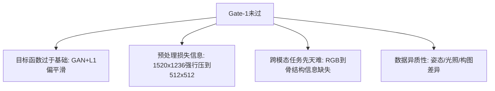
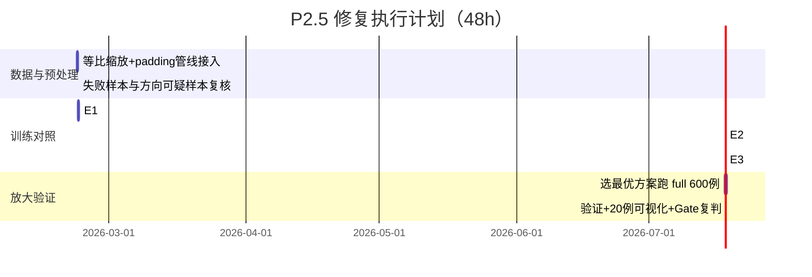

# Full Baseline 复盘与修复计划（教师指挥官版）

> 时间：2026-02-21  
> 目标：解释“为什么 full 仍未过 Gate-1”，并给出可执行的下一步路线。

---

## 1. 现状总览（结论先说）

- 环境正常，不是 CUDA/虚拟环境问题。
- Full 相比 Small **有明确提升**，但仍不足以支撑“可描点可测量”。
- 当前项目处于：**“已跑通 + 有进步 + 但临床可用性门槛未过”**。

---

## 2. 我核查到的关键结果（基于产物复核）

### 2.1 指标变化（Small -> Full）
- Small：`mean_l1=0.203312`，`mean_psnr=15.852553`
- Full：`mean_l1=0.182668`，`mean_psnr=16.381398`
- 变化：
  - L1：`-10.15%`（更好）
  - PSNR：`+3.34%`（更好）

### 2.2 但为什么仍判“不通过”
- `full_viz_grid_20.png` 中仍可见：
  - 下颌缘、牙槽区边缘偏软；
  - 局部重影/错位感；
  - 细骨性纹理不稳定。
- 即：**统计指标提升 ≠ 可稳定描点**。

### 2.3 失败样本结构
- Full 验证失败：`29/100`
- 失败集中在若干固定 ID（如 24、26、53、561、333 等）。
- 审计标签交叉显示：
  - `border_issue` 在失败集中占比并不高（说明“边框”不是主矛盾）；
  - `orientation_suspect/outlier` 相对更值得关注。

---

## 3. 根因判断（按优先级）

### 核心解释
1. **GAN+L1 方案天然容易“平滑化”**，对骨缘细节不够友好。  
2. **当前 resize 到 512x512 会引入比例形变**（原图非正方形），会损伤结构一致性。  
3. 任务本质是跨模态反演，样本增加虽有帮助，但仅靠“多跑一些”不够。  

---

## 4. 下一步策略（先稳 512，再谈高分辨率）

## 4.1 战略原则
- 不直接冲 768/1024；
- 先在 512 把“结构可描点”打稳；
- 做小规模对照实验，按证据决策。

## 4.2 三步修复路线（P2.5）

### Step-1：预处理修复（优先级最高）
- 改为 **保持长宽比 + padding（letterbox）**，避免几何拉伸。
- 固定头影关键 ROI（尽量减少背景干扰）。

### Step-2：损失函数修复
- 在 GAN+L1 基础上，加 **边缘/梯度一致性损失**（建议权重 5~10）。
- 再加感知损失做小网格，并把 `lambda_l1` 从 100 下探到 80/60。

### Step-3：失败样本专项
- 针对失败高频 ID 建立“难例清单”；
- 对 orientation_suspect 样本做复核（翻转/方向一致性）；
- 审计中的 border 标签不作为主要剔除依据。

---

## 5. 执行计划（48小时）

---

## 6. 复判门槛（建议）

除主观 Gate-1（骨缘可描点、无明显结构伪影）外，增加客观门槛：
- `mean_l1 <= 0.170`
- `mean_psnr >= 17.0`
- 失败样本数 `<= 20/100`

> 达不到则继续在 512 迭代；达到后再进入 P3（768 起步）。

---

## 7. 当前指挥决策

- **不回退、不焦虑、不中断。**
- 现在不是“推翻重来”，而是进入 **P2.5 结构化修复阶段**。
- 只要先把 512 的结构稳定性打出来，后续升分辨率才有意义。

---

## 8. 关键文件（复盘依据）

- `/root/autodl-tmp/X/CodexDev/Execution_X_P1P2/docs/full_baseline_execution_report.md`
- `/root/autodl-tmp/X/CodexDev/Execution_X_P1P2/outputs/metrics/full_val_metrics.json`
- `/root/autodl-tmp/X/CodexDev/Execution_X_P1P2/outputs/metrics/full_failure_stats.json`
- `/root/autodl-tmp/X/CodexDev/Execution_X_P1P2/outputs/viz/full/full_viz_grid_20.png`
- `/root/autodl-tmp/X/CodexDev/Execution_X_P1P2/outputs/metrics/small_val_metrics.json`
- `/root/autodl-tmp/X/CodexDev/Execution_X_P1P2/outputs/viz/small/small_viz_grid_20.png`
