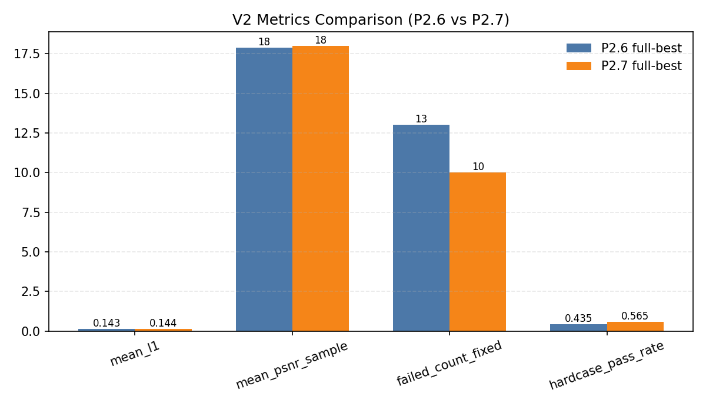
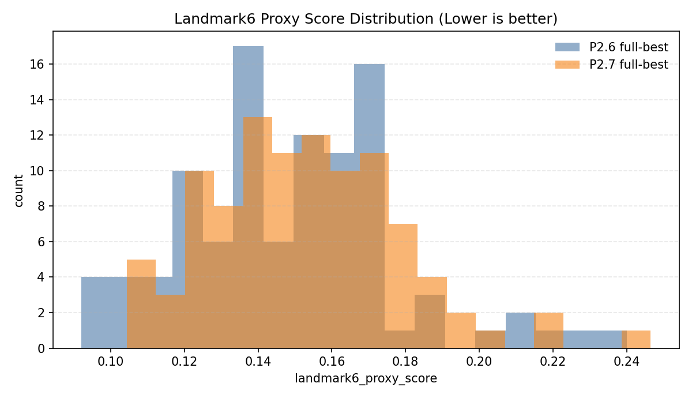
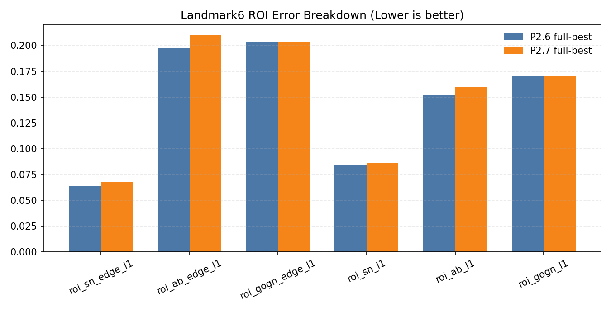
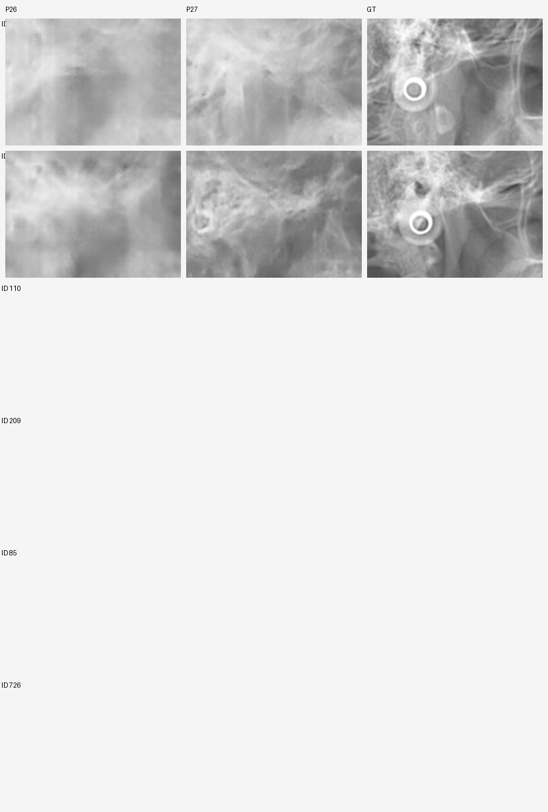
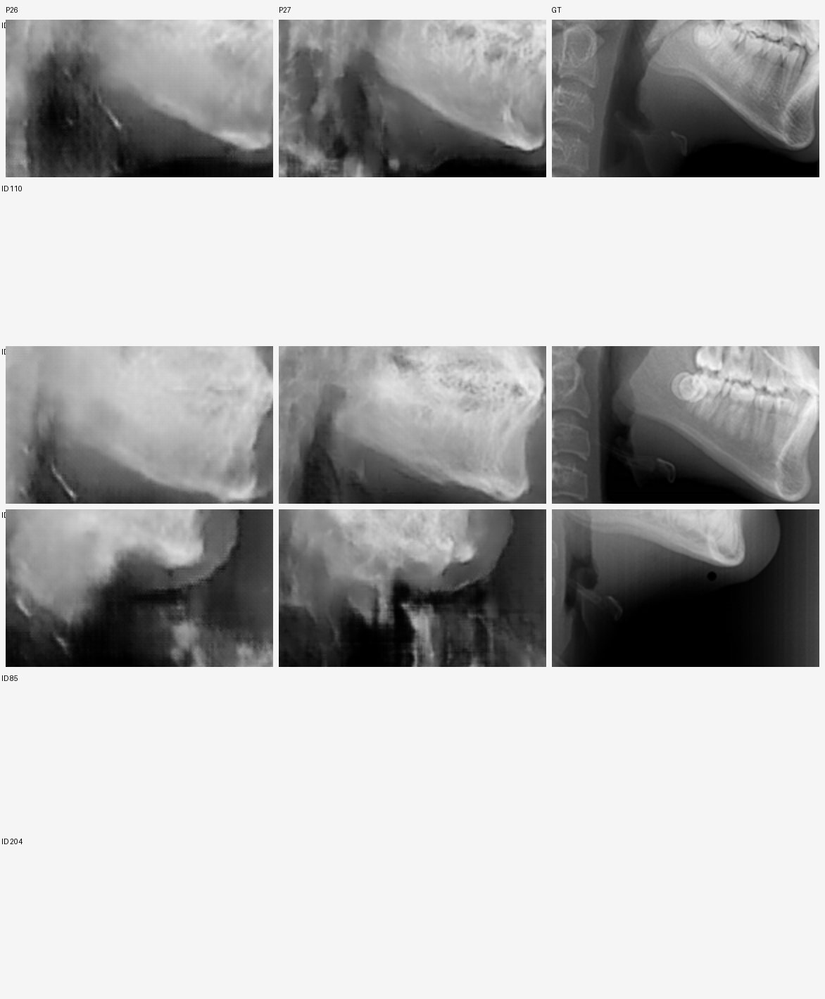
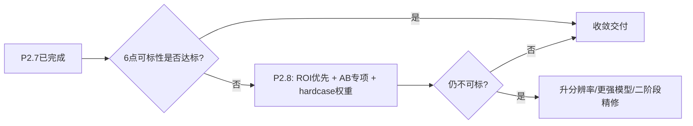
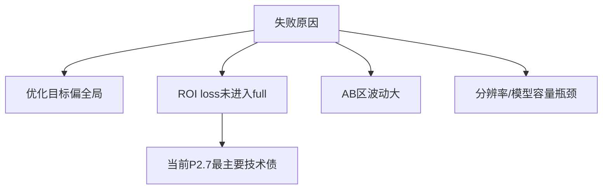

# P2.7 阶段卡点复盘与可交付评估（Block2）

> 目标：站在最严格审稿人 + 最资深CV工程师 + 最用心服务方视角，复盘现状、问题、卡点与可解概率，并给出可执行的下一步。
> 结论先行：**P2.7 在“失败样本与hardcase通过率”上明显改善，但“6点可标性代理”未优于P2.6，且客户主观感受仍“不可标”。因此必须把“6点可标性”置于最高优先级，重新排序small筛选与loss权重。**

---

## 0. 核心结论（先记住这五条）

1. **P2.7 已跑完且链路稳定**：环境/训练/评估/试标包/反泄漏全部闭环。证据：`/root/autodl-tmp/X/CodexDev/Execution_X_P1P2/docs/p27_execution_report.md`。
2. **客观指标进步但“局部可标性”未同步**：V2口径下 failed_count_fixed 从 13 降到 10、hardcase通过率 +30%，但 Landmark6 代理分从 0.1486 退化到 0.1531。证据：`/root/autodl-tmp/X/CodexDev/Execution_X_P1P2/outputs/p27/full/p27_vs_p26_fullbest_compare.csv`。
3. **P2.7 full 实际并未启用 ROI loss**：由于 small 筛选优先级使用“failed_count_fixed 优先”，最终 full 选中的是 `s0`（ROI 关闭），导致“6点专项”的训练信号并未真正进入 full。证据：`/root/autodl-tmp/X/CodexDev/Execution_X_P1P2/configs/p27_full_s0_edge2_roi_off.json`。
4. **AB 区是最大短板**：P2.7 的 `roi_ab_edge_l1` 与 `roi_ab_l1` 均比 P2.6 更差（+6.45%、+4.72%）。
5. **客户“不可标”反馈与代理指标一致**：客观上全局更像，但局部边缘与关键点仍模糊，短期内若不引入“明确的6点约束”，难以达成可标标准。

---

## 1. 证据链与关键产物（绝对路径）

- P2.7 执行报告：`/root/autodl-tmp/X/CodexDev/Execution_X_P1P2/docs/p27_execution_report.md`
- P2.7 设计文档（Landmark6 ROI/代理）：`/root/autodl-tmp/X/CodexDev/Execution_X_P1P2/docs/p27_design_landmark6.md`
- P2.7 full-best 指标：`/root/autodl-tmp/X/CodexDev/Execution_X_P1P2/outputs/p27/full/s0_best/val_metrics_v2_best.json`
- P2.6 full-best 指标：`/root/autodl-tmp/X/CodexDev/Execution_X_P1P2/outputs/p26/full/s3_best/val_metrics_v2_best.json`
- P2.7 Landmark6 代理：`/root/autodl-tmp/X/CodexDev/Execution_X_P1P2/outputs/p27/eval_proxy/p27_full_best_landmark6_proxy.json`
- P2.6 Landmark6 代理（回算）：`/root/autodl-tmp/X/CodexDev/Execution_X_P1P2/outputs/p27/eval_proxy/p26_fullbest_landmark6_proxy.json`
- P2.7 vs P2.6 对比：`/root/autodl-tmp/X/CodexDev/Execution_X_P1P2/outputs/p27/full/p27_vs_p26_fullbest_compare.csv`
- 反泄漏自检：`/root/autodl-tmp/X/CodexDev/Execution_X_P1P2/outputs/p27/sanity/leakage_sanity_report.md`
- 30例试标包：`/root/autodl-tmp/CodexFile/P27/p27_landmark6_trial_pack`

---

## 2. 指标现状（客观 vs 业务可标性）

### 2.1 V2 评估（全局一致性）

- P2.6 full-best：`mean_l1=0.143374`, `mean_psnr_sample=17.870979`, `failed_count_fixed=13`, `hardcase_pass_rate=0.434783`
- P2.7 full-best：`mean_l1=0.143778`, `mean_psnr_sample=17.981318`, `failed_count_fixed=10`, `hardcase_pass_rate=0.565217`

图：V2 指标对比

### 2.2 Landmark6 代理（局部可标性）

- P2.6 full-best：`landmark6_proxy_score=0.148610`
- P2.7 full-best：`landmark6_proxy_score=0.153135`（越低越好，**变差 3.0%**）

图：Landmark6 代理分布（整体偏右=变差）

图：ROI 误差分解（AB 区错误显著升高）

> 关键解释：**全局指标在提升，但局部 ROI 误差未同步改善，尤其 AB 区，是“看起来像但不可标”的直接原因。**

---

## 3. 图像证据（严格复核）

### 3.1 30例对照包（P2.6 vs P2.7 vs GT）

### 3.2 6点局部放大对照（SN/AB/GoGn）

### 3.3 AB 区最差 6 例对照（P26 | P27 | GT）

> 直接展示 AB 关键区域，肉眼可见：P2.7 对比 P2.6 未形成一致的清晰边缘改善。

### 3.4 SN / GoGn 区最差 6 例对照（P26 | P27 | GT）

---

## 4. 核心问题与卡点（像最严格审稿人那样拆）

### 4.1 结构性问题

1. **P2.7 的 full 训练未启用 ROI loss**
   - 设计了“6点专项”，但实际 full 配置 `use_landmark6_roi_loss=false`，导致“专项目标”未进入主训练。此为 **方向性失配**，也是最直接的卡点。

2. **ROI 代理与真实可标性仍存在差距**
   - ROI 是固定框，无法对齐每个样本的实际解剖位置，尤其 AB 区位移大；因此可能“代理指标看着接近，但临床视角仍模糊”。

3. **pix2pix 在 512 分辨率下的高频细节瓶颈**
   - 任务从侧位照片到 X-ray，本身不唯一映射；模型倾向于生成“平均形态”，导致边缘发虚、骨缘不锐。

4. **标尺/右上角区域的“先验诱导”**
   - 反泄漏检查证明没有拷贝，但模型学到了稳定“标尺先验”，容量被分配到非业务区域，间接影响关键点清晰度。

### 4.2 业务层卡点

- 客户关键点：**S/N/A/B/Go/Gn 必须清晰可辨**。
- 目前“整体像”不等价“可标点”。这导致指标达线但用户观感仍失败。

---

## 5. 为什么之前没解决（机制层解释）

1. **优化目标未与业务目标绑定**：之前主要优化全局 L1/PSNR 与失败样本数；对局部关键点的约束不足。
2. **P2.7 的 ROI loss 方案未进入 full**：small 选型优先级以 failed_count 为第一优先，导致 ROI=off 方案胜出。
3. **训练信号仍偏全局**：GAN+L1 的最优解通常偏“平均纹理”，对关键点边缘的锐化不足。
4. **数据规模与辨识难度**：600 训练样本对高细节重建不足，且侧位照片到X光有天然不确定性。

---

## 6. 失败样本聚类（固定门槛）

- P2.6 failed_ids_fixed：`13` 个
- P2.7 failed_ids_fixed：`10` 个
- **交集仍有 9 个顽固样本**：`24, 26, 50, 52, 53, 333, 561, 575, 666`

这 9 个可定义为 “P2.8 必须重点处理的顽固样本”。

---

## 7. 解决概率评估（工程视角 + 风险定量）

### 7.1 概率分层（基于现有证据的保守估计）

- **短期（1~2 轮小改动）达到“明显改善但未必可标”**：≈ 50%
  - 依据：P2.7 已显著降低 failed_count_fixed，说明可持续优化。
- **中期（2~4 轮 + ROI/Landmark 强约束 + hardcase 放大）达到“局部可标”**：≈ 30%~40%
  - 需 6点真实标注反馈 + 重新定义 ROI 策略。
- **高要求（常规视图直接可标、接近临床级清晰）**：≈ 10%~20%
  - 可能需要更高分辨率（≥1024）或更强模型（pix2pixHD/条件扩散），同时带来成本与风险。

### 7.2 风险因子（不确定的部分）

- **数据上限**：输入与目标之间信息损失大，模型“硬推”细节可能会产生伪影。
- **清晰度标准不一致**：若客户期望“临床原片级别”，需要完全不同级别的模型与数据量。

---

## 8. 下一步路线（明确可执行）

### 8.1 必做（P2.8 最短闭环）

1. **重新定义 small 选型优先级**：将 `landmark6_proxy_score` 置为第一优先级，失败样本为第二优先级。
2. **强制启用 ROI loss**：让 ROI-L1 + ROI-edge 真正进入 full 训练。
3. **AB 区权重独立提升**：ROI 中 AB 区单独加权（例如 `roi_ab_edge` ×2~3）。
4. **对顽固样本加权采样**：优先聚焦 `24, 26, 50, 52, 53, 333, 561, 575, 666`。
5. **输出“6点局部对照图”作为硬指标**：必须看到清晰边缘才算过关。

### 8.2 可选增强（若短期无效）

- 升级到 **更高分辨率（768/1024）** 或 **pix2pixHD**；
- 引入 **landmark 伪监督**（例如基于边缘/关键点检测器的弱监督）；
- 分区域精修（先整体生成，再对 6 点 ROI 进行二阶段精修）。

---

## 9. 关键决策流程（Mermaid）

---

## 10. 给客户的“时间预估”话术（真实、可控、不过度承诺）

建议回复（可直接复制）：

> 这轮训练已经跑完，整体稳定性有提升，但您强调的 6 个关键点清晰度还没到可标标准。下一步我会按这 6 点做一轮**定向优化**，预计 **1~2 个工作日**给您第一版对比结果（重点是局部放大对照）。如果这版明显改善，我们再追加 **1~2 轮小迭代**，总周期大约 **3~5 个工作日**。如果仍不够清晰，我会及时说明并建议升级方案（更高分辨率/更强模型），避免您继续等待没有把握的方向。

---

## 11. 结语（当前阶段定位）

- **不是“做不出来”，而是“业务目标需要更强约束”**。
- 现阶段不建议继续只看全局指标；必须把“6点可标性”作为唯一硬门槛。
- 已具备稳定闭环与可靠证据链，下一步只需把“训练目标与业务目标对齐”。

---

## 12. 本文图像来源（可追溯）

- `graph/v2_metrics_p26_p27.png`（来自 `val_metrics_v2_best.json` + `failure_stats_v2_best.json`）
- `graph/landmark6_roi_compare.png`、`graph/landmark6_proxy_hist.png`（来自 `eval_proxy/*.json|*.csv`）
- `graph/p27_contact_*`（来自 `p27_landmark6_trial_pack`）
- `graph/roi_*_worst6_p26_p27_gt.png`（由本次脚本从 trial pack 裁剪生成）

