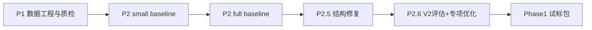

# Phase1 传承手册（全量上下文 + 绝对路径）

> 目的：给任何新开 Codex 一次性注入完整上下文，让其“即开即接班”。
> 
> 当前主机时间基准：2026-02-23（UTC+8）

---

## 0. 一句话现状

- 主线已经从 P1 数据工程 -> P2 基线 -> P2.5 修复 -> P2.6 协议升级完成闭环。
- 目前可交付候选模型：**P2.6 full-best**（pix2pix，不是 pix2pixHD）。
- 当前对外试标包也已打好：`/root/autodl-tmp/CodexFile/Phase1/p26_trial_pack.zip`。

---

## 1. 绝对路径总览（先记住这几个）

## 1.1 工作根目录

- Feasibility 当前目录：`/root/autodl-tmp/X/CodexDev/Feasibility`
- 代码执行根目录（训练/评估主工程）：`/root/autodl-tmp/X/CodexDev/Execution_X_P1P2`

## 1.2 数据集根目录（只读）

- 原始数据根目录：`/root/autodl-tmp/baidu_dl/分层分组（按骨面型）已整好1520✖️1236`
- 关键文件：
  - `.../data.csv`
  - `.../train_ids.csv`
  - `.../val_ids.csv`
  - `.../test_ids.csv`
  - `.../训练集/侧位照片/*.2.png`
  - `.../训练集/x线片/*.1.png`
  - `.../验证集/侧位照片/*.2.png`
  - `.../验证集/x线片/*.1.png`

## 1.3 报告与交付路径

- P2.6 指挥复盘：`/root/autodl-tmp/X/CodexDev/P26/P26.md`
- 深度阻塞分析：`/root/autodl-tmp/CodexFile/Block/block.md`
- 对外主报告：`/root/autodl-tmp/CodexFile/Report/Report.md`
- 对外图表目录：`/root/autodl-tmp/CodexFile/Report/graph`
- 试标包目录：`/root/autodl-tmp/CodexFile/Phase1/p26_trial_pack`
- 试标 zip：`/root/autodl-tmp/CodexFile/Phase1/p26_trial_pack.zip`

---

## 2. 不可违反的工程约束（血条）

1. 不新建虚拟环境，不重装 torch/cuda。
2. 解释器固定：`/root/miniconda3/bin/python`。
3. 原始数据目录只读，不允许改写、重命名、删除。
4. 所有新增产物写到任务输出目录（如 `Execution_X_P1P2/outputs/...` 或 `CodexFile/...`）。
5. 默认先用已有脚本和配置，不要重复造轮子。

---

## 3. 环境基线（镜像事实）

已验证环境：

- Python：3.12.3
- PyTorch：2.3.0+cu121
- torch.cuda.is_available()：True
- GPU：NVIDIA vGPU-32GB
- nvcc：12.1.105

参考文件：

- `Execution_X_P1P2/docs/env_gpu_check.md`
- `Execution_X_P1P2/docs/p26_env_check.md`

快速检查命令：

```bash
export CUDA_VISIBLE_DEVICES=0 OMP_NUM_THREADS=8 MKL_NUM_THREADS=8
/root/miniconda3/bin/python - <<'PY'
import torch,sys
print(sys.executable)
print(torch.__version__)
print(torch.cuda.is_available())
if torch.cuda.is_available():
    print(torch.cuda.get_device_name(0))
PY
```

---

## 4. 数据编码与索引逻辑（最容易踩坑）

## 4.1 编码

- `data.csv` 必须按 `gb18030` 读取。
- 对应实现：`/root/autodl-tmp/X/CodexDev/Execution_X_P1P2/src/indexing.py`（`read_metadata`）。

## 4.2 ID 配对规则

- 输入图：`ID.2.png`（侧位照片）
- 目标图：`ID.1.png`（x线片）
- split 来自 `train_ids.csv / val_ids.csv / test_ids.csv`。

## 4.3 索引产物

- `.../data_index/pairs_train.csv`（600）
- `.../data_index/pairs_val.csv`（100）
- `.../data_index/pairs_test.csv`（100）

构建脚本：`/root/autodl-tmp/X/CodexDev/Execution_X_P1P2/scripts/build_pairs_index.py`

---

## 5. 里程碑演进（时间主线）



## 5.1 P1（数据工程）

完成：

- 固化 train/val/test 清单；
- 质检（曝光、边框、方向可疑、离群）；
- 审计文档。

关键文件：

- `Execution_X_P1P2/docs/data_audit.md`
- `Execution_X_P1P2/outputs/audit/audit_summary.json`
- `Execution_X_P1P2/outputs/audit/audit_detail.csv`

## 5.2 P2（pix2pix baseline）

- 小样 Gate 未过；
- full baseline 运行成功但仍有明显结构性失败。

## 5.3 P2.5（修复轮）

改动：

- 加入 letterbox（保持比例）
- 增加 edge/perceptual 可选项（最终 E1 最稳）

结果：指标提升明显，但按当时判定仍未通过。

## 5.4 P2.6（当前关键版本）

完成两件大事：

1. 评估协议 V2：
   - 同时输出 `mean_psnr_sample` + `mean_psnr_batch`
   - Gate 默认用 sample 口径
   - 引入 fixed threshold 失败计数
2. 训练链路升级：
   - best checkpoint 机制
   - small 网格（S0-S3）
   - full 最优落在 S3 + best checkpoint

---

## 6. 当前最重要结论（必须背熟）

## 6.1 模型事实

- 当前不是 pix2pixHD，仍是 pix2pix 体系。
- 分辨率说法：模型输入输出张量仍是 512x512；采用 letterbox 后，内容区约 512x417（以 1520x1236 为例），上下补边到 512。

## 6.2 指标事实（V2）

- Baseline -> P2.6 full-best：
  - mean_l1：0.182668 -> 0.143374（-21.51%）
  - mean_psnr_sample：16.691880 -> 17.870979（+7.06%）
  - failed_count_fixed：29 -> 13
  - hardcase_pass_rate：0.0000 -> 0.4348

来源：

- `outputs/p26/reval/baseline_full_v2/val_metrics_v2.json`
- `outputs/p26/reval/baseline_full_v2/failure_stats_v2.json`
- `outputs/p26/full/s3_best/val_metrics_v2_best.json`
- `outputs/p26/full/s3_best/failure_stats_v2_best.json`

## 6.3 Gate 结论

按 V2 判定（L1<=0.170, PSNR>=17, failed<=20），**P2.6 已通过**。

---

## 7. P2.6 技术变更点（给新 Codex 的代码定位）

## 7.1 新评估核心

- `src/eval_utils.py`（新增）
- `scripts/validate_pix2pix.py`（双 PSNR 口径）
- `scripts/compute_failure_stats.py`（fixed threshold + hardcase统计）
- `docs/eval_protocol_v2.md`

## 7.2 训练核心

- `scripts/train_pix2pix.py`：best checkpoint + val history + weighted sampler 接入
- `src/pairs_dataset.py`：支持 weighted sampler
- `src/config_utils.py`：新增 sampler/best/log 等配置项

## 7.3 P2.6 配置文件

- `configs/p26_small_s0_edge0_sampler_off.json`
- `configs/p26_small_s1_edge0_sampler_on_w2.json`
- `configs/p26_small_s2_edge1_sampler_on_w2.json`
- `configs/p26_small_s3_edge2_sampler_on_w2.json`
- `configs/p26_full_s3_edge2_sampler_on_w2.json`

---

## 8. 已知卡点与正确理解

1. `failed_count_fixed` 已显著下降，但仍有持续难例簇（12个 persistent）。
2. weighted sampler 机制已接入，但当前 hardcase 清单源于 val persistent IDs，和 train 子集命中为 0（日志里可见 `hardcase_hits_in_train_subset=0`）。
3. 因 GAN 训练震荡，交付必须看 best checkpoint，不可只看 last。

---

## 9. 已有报告与图表清单（可直接复用）

## 9.1 阻塞分析版

- 主文档：`/root/autodl-tmp/CodexFile/Block/block.md`
- 图表：`/root/autodl-tmp/CodexFile/Block/graph`

## 9.2 对外报告版

- 主文档：`/root/autodl-tmp/CodexFile/Report/Report.md`
- 图表：`/root/autodl-tmp/CodexFile/Report/graph`

## 9.3 P2.6 指挥复盘版

- 主文档：`/root/autodl-tmp/X/CodexDev/P26/P26.md`
- 图表：`/root/autodl-tmp/X/CodexDev/P26/graph`

---

## 10. Phase1 试标包（已完成）

## 10.1 位置

- 目录：`/root/autodl-tmp/CodexFile/Phase1/p26_trial_pack`
- 压缩包：`/root/autodl-tmp/CodexFile/Phase1/p26_trial_pack.zip`
- GPU检查记录：`/root/autodl-tmp/CodexFile/Phase1/gpu_env_check.md`

## 10.2 样本策略

- 总样本：30
- A组（不过线）：13
- B组（hardcase已通过）：10
- C组（稳定通过参考）：7

详见：

- `.../manifest.csv`
- `.../selection_summary.json`
- `.../README.md`

---

## 11. 高频问答（对外沟通口径）

### Q1：现在是 pix2pixHD 吗？

A：不是。当前交付版是 pix2pix 迭代优化版本（P2.6），已满足本轮约定指标。

### Q2：现在分辨率到底是多少？

A：模型输入输出仍为 512x512；为避免形变，采用等比例缩放+补边（letterbox），有效内容区约 512x417（随原图比例变化）。

### Q3：是不是最终版？

A：就当前阶段指标与试标需求，这版可作为阶段最终交付候选版；后续可进入“增强版”（例如更高分辨率或架构升级）阶段。

---

## 12. 新 Codex 开工清单（5分钟启动）

1. 先读本文件（`Phase1.md`）。
2. 再读：`Execution_X_P1P2/docs/p26_execution_report.md`、`eval_protocol_v2.md`。
3. 跑环境检查，确认解释器和 GPU 正常。
4. 只在指定输出目录产生产物，不要动原始数据。
5. 所有沟通、报告、脚本路径必须写绝对路径。

---

## 13. 常用命令模板

## 13.1 V2 评估单 checkpoint

```bash
export CUDA_VISIBLE_DEVICES=0 OMP_NUM_THREADS=8 MKL_NUM_THREADS=8
/root/miniconda3/bin/python /root/autodl-tmp/X/CodexDev/Execution_X_P1P2/scripts/validate_pix2pix.py \
  --config /root/autodl-tmp/X/CodexDev/Execution_X_P1P2/configs/p26_full_s3_edge2_sampler_on_w2.json \
  --device cuda \
  --checkpoint /root/autodl-tmp/X/CodexDev/Execution_X_P1P2/outputs/p26/full/s3_best/checkpoints/p26_full_s3_edge2_sampler_on_w2_best.pt \
  --output-json /tmp/val_metrics_v2.json
```

## 13.2 V2 失败统计

```bash
export CUDA_VISIBLE_DEVICES=0 OMP_NUM_THREADS=8 MKL_NUM_THREADS=8
/root/miniconda3/bin/python /root/autodl-tmp/X/CodexDev/Execution_X_P1P2/scripts/compute_failure_stats.py \
  --config /root/autodl-tmp/X/CodexDev/Execution_X_P1P2/configs/p26_full_s3_edge2_sampler_on_w2.json \
  --checkpoint /root/autodl-tmp/X/CodexDev/Execution_X_P1P2/outputs/p26/full/s3_best/checkpoints/p26_full_s3_edge2_sampler_on_w2_best.pt \
  --device cuda \
  --output-per-sample-csv /tmp/val_per_sample_v2.csv \
  --output-failure-json /tmp/failure_stats_v2.json
```

---

## 14. 交接建议（你要像“继承基因”那样交）

- 对新人只强调三件事：
  1) 路径固定（绝对路径）
  2) 协议固定（V2）
  3) 输出固定（best checkpoint + failure_stats_v2）
- 有争议时以 JSON 结果和脚本源码为准，不以口头描述为准。

---

## 15. 本文件维护规则

- 每次阶段推进（例如 P2.7、P3）都在本文件新增一节：
  - 变更内容
  - 新路径
  - 新指标
  - 新风险
  - 新决策
- 禁止只改“结论”不改“证据路径”。

