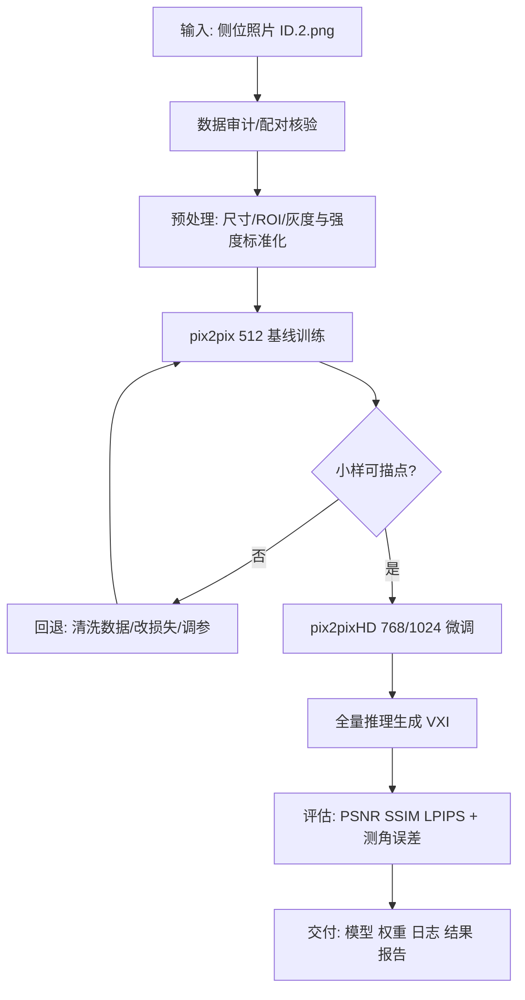
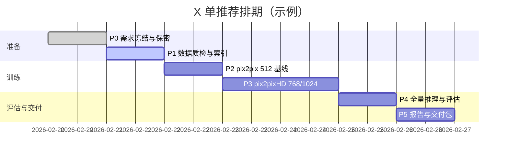
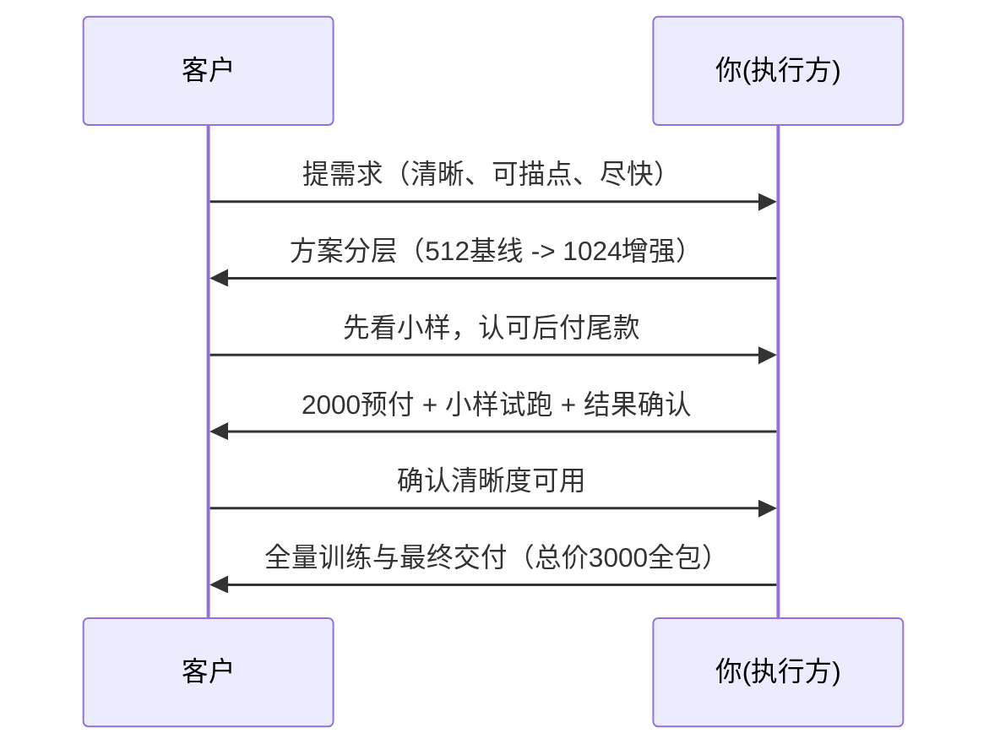

# X 单可行性统筹计划（教师指挥官版）

> 版本：v1.0  
> 编写日期：2026-02-20  
> 用途：给你本人执行 + 给新开 Codex 无缝接手 + 给医学背景小白快速理解全局

---

## 0. 我已阅读/核验的上下文（只读）

### 0.1 需求与沟通材料（`/root/autodl-tmp/CodexFile/Feasibility`）
- `Demand_X/DemandCodex.md`、`Demand_X/DemandCodex.pdf`：客户原始需求与聊天过程。
- `Demand_X/docs_X/论文精翻译.pdf`：参考文献（实为 AIS 背部照片生成虚拟 X 线的论文翻译版）。
- `Demand_X/graphs/*`：侧位照、真实头影 X 线、测量软件截图示例。
- `X_000/医学图像生成方案.htm`：你接单时与 ChatGPT 的完整可行性分析聊天记录（12段）。

### 0.2 数据集（只读检查）
- 路径：`/root/autodl-tmp/baidu_dl/分层分组（按骨面型）已整好1520✖️1236`
- 已核验事实：
  - 共 800 例回顾性样本，已分为 train/val/test = 600/100/100。
  - 每例成对文件：`ID.2.png`（侧位照片）↔ `ID.1.png`（x线片）。
  - 三个子集 ID 无重叠，合计唯一 ID=800。
  - 1600 张图（双模态）全部可正常读取，无损坏。
  - 全部分辨率统一为 `1520x1236`。
  - x线片虽然是 RGB PNG，但三通道几乎等价（近灰度），可按灰度处理。
  - `data.csv` 编码是 `GB18030`（不是 UTF-8），含字段：姓名、性别、年龄、骨面型。
  - 分层分组基本一致：train/val/test 的骨面型比例接近总体分布（42/40/18）。
  - 元数据概览（800例）：女 461（57.6%）、男 339（42.4%）；年龄 3-44 岁，均值约 17.5。

### 0.3 关键业务约束（来自聊天）
- 客户核心诉求：**清晰到可描点测角/线距**，不是只要“看起来像”。
- 客户当前不强制指定分辨率，但希望清晰。
- 你已沟通过报价与交付逻辑：`3000 全包`（可先 `2000` 小样试跑）。
- 客户是计算机小白，需要你持续解释。
- 当前已拿到回顾性数据；外部/前瞻数据后续可能补充（聊天中提到）。

### 0.4 沟通里程碑（按聊天记录）
| 日期 | 事件 | 你应对后的含义 |
|---|---|---|
| 2026-02-15 | 客户提出需求与预算（1000-2000） | 需求核心是“生成+准确度对比+尽快” |
| 2026-02-16 | 明确“分辨率不限，但必须清晰可描点” | 技术目标从“跑通”升级为“可测量可用” |
| 2026-02-16 | 你提出 `3000` 全包，支持先小样 | 形成“先验收小样再全量”的正确策略 |
| 2026-02-18 | 客户问训练时长、能否答疑 | 需以通俗语言持续解释工程进度 |
| 2026-02-19 | 客户给回顾性数据（1520x1236） | 项目进入可执行阶段（先做 800 回顾性） |

---

## 1. 教师指挥官先定调：这单“能做什么、不能承诺什么”

### 1.1 可行性结论
- **论文级可行：高**（可做配对生成 + 量化指标 + 案例展示 + 误差讨论）。
- **临床替代级承诺：低**（不能承诺“完全替代真实 X 线诊断”）。

### 1.2 为什么“清晰”不等于“可测量准确”
- 模型可以把图做锐，但骨性标志点可能偏（这是跨模态反演的天然难点）。
- 所以验收必须分两层：
  1) 图像质量层：PSNR/SSIM/LPIPS；
  2) 临床可用层：关键点/角度/线距误差（若有标注或可半自动测量）。

### 1.3 与参考论文的关系（防止误读）
- 论文是 **背部 2D-RGB → 脊柱 VXI（AIS）**，不是正畸侧貌→头影 X 线。
- 但可迁移的方法是：配对 cGAN、严格预处理、分层评估、外部/前瞻验证、局限性写法。

---

## 2. 给新手的核心概念翻译（最少术语版）

| 概念 | 一句话解释 | 在本单的作用 |
|---|---|---|
| 配对图像翻译 | 输入图和目标图一一对应学习映射 | 本单主任务本质 |
| cGAN/pix2pix | “生成器+判别器”做配对翻译基线 | 起步最快、最稳 |
| pix2pixHD | pix2pix 的高分辨率增强版 | 冲清晰度与细节 |
| CycleGAN | 无配对翻译模型 | 你已配对，不建议主用 |
| RegGAN 思路 | 给错位配对做配准纠偏 | 对“姿态不齐”时很有用 |
| LPIPS | 更接近“感知差异”的图像指标 | 只看 PSNR/SSIM 不够时补充 |
| Bland-Altman | 比较两种测量一致性的方法 | 后期角度测量可用 |

---

## 3. 总体技术路线（先稳后清晰）

---

## 4. 分阶段执行计划（可直接照着干）

## 阶段 P0：需求冻结与风险边界（0.5 天）
- 明确验收语言：**“可描点可测量”优先于“视觉好看”**。
- 明确交付边界：本期不承诺临床替代结论。
- 明确保密：建议补签 NDA/数据保密条款（含患者影像）。

**产出**：1页《范围与验收约定》文本。

## 阶段 P1：数据工程与质检（0.5-1 天）
- 固化索引：把 `ID.2 -> ID.1` 配对关系输出成训练清单 CSV。
- 做最小清洗：检查异常曝光、边框、黑边、方向、离群样本。
- 制作可复现实验清单：train/val/test 固定，不改原始数据。
- 记录编码注意：`data.csv` 读取需 `gb18030`。

**产出**：`pairs_train.csv`、`pairs_val.csv`、`pairs_test.csv`、`data_audit.md`。

## 阶段 P2：基线训练（pix2pix 512）（0.5-1 天 GPU）
- 目标：先跑通“能稳定收敛 + 不糊成片”的基线。
- 建议：先 50-100 例试跑，再切全量 600 例训练。
- 监控：训练曲线、验证集可视化、失败样本类型。

**小样门槛（Gate-1）**：
- 关键骨缘（下颌缘、牙槽区、颅底轮廓）可辨；
- 与 GT 对比不出现明显结构性错位伪影。

## 阶段 P3：高清增强（pix2pixHD 768/1024）（1-2 天 GPU）
- 在 P2 权重基础上迁移微调，不建议直接硬上 1024。
- 可选增强项（按时间和风险择一）：
  - 边缘/梯度一致性损失（提骨缘锐度）；
  - 感知损失（提视觉细节，但要防“看着清晰但不真实”）；
  - 轻量配准分支（若发现输入输出几何偏移明显）。

**小样门槛（Gate-2）**：
- 客户示例图上可完成基础描点；
- 比 P2 主观清晰度明显提升。

## 阶段 P4：全量推理与评估（0.5-1 天）
- 全量跑 train/val/test 生成图。
- 指标：PSNR、SSIM、LPIPS（至少三项）。
- 若能拿到标志点或测量软件导出：补角度/线距误差统计 + 一致性分析。

**产出**：
- 生成结果目录（按 split 分开）；
- 指标汇总 `metrics_summary.csv`；
- 典型成功/失败案例图板。

## 阶段 P5：交付与复盘（0.5 天）
- 交付最小包：权重、推理脚本、配置、日志、报告。
- 给客户的解释文案：怎么用、能做什么、不能做什么。
- 复盘清单：下一期如加外部/前瞻数据，怎么升级。

## 阶段 P6（可选二期）：测量一致性增强（1-2 周）
- 前提：拿到关键点标注或可导出测角结果。
- 方向：
  - 生成 + 关键点一致性联合损失；
  - 或新增配准模块，降低姿态误差传播。
- 目标：把“看着像”提升到“测量更稳”。

### 建议默认参数（供新开 Codex 直接落地）
| 模块 | 默认值 | 备注 |
|---|---|---|
| Baseline 模型 | pix2pix（U-Net + PatchGAN） | 先稳后快 |
| 高清模型 | pix2pixHD | 用于 768/1024 微调 |
| 输入尺寸 | 先 512，再 768/1024 | 不建议首跑 1024 |
| 优化器 | Adam | 参考文献常用配置 |
| 学习率 | 2e-4 | 可配线性衰减 |
| Batch size | 1-4（视显存） | 高分辨率通常 1 |
| 训练轮数 | 100-200 起步 | 小样可先短训看趋势 |
| 基础损失 | GAN + L1 | 可叠加梯度/感知损失 |
| 评估指标 | PSNR + SSIM + LPIPS | 至少三项一起看 |

---

## 5. 时间排期（按 2026-02-20 启动）

> 实际总工期：约 4-7 天（受 GPU 排队、返工次数、客户确认速度影响）。

---

## 6. 验收体系（防止“说不清”）

### 6.1 双层验收标准
1) **图像层（机器指标 + 主观可视）**
- PSNR/SSIM/LPIPS 三指标完整报告；
- 至少给出 20 例并排图（输入/GT/预测）供人工评审。

2) **测量层（临床可用性）**
- 若有测量点：统计角度/距离误差（MAE/SD）；
- 无测量点：至少做“可描点可操作性”盲评记录（医生是否能稳定下点）。

### 6.2 交付口径建议
- 承诺“科研/方法验证可用”，不承诺“临床诊断替代”。
- 报告里单独写局限：数据规模、姿态偏差、域外泛化风险。

---

## 7. 高风险点与对策（实战版）

| 风险 | 表现 | 对策 |
|---|---|---|
| 输入输出轻微错位 | 骨缘双影、结构漂移 | 先做配准/ROI统一，再训 |
| 直接冲 1024 不稳定 | 发散、伪影、训练慢 | 先 512 稳定，再升分辨率 |
| 过度追“锐化” | 看起来清晰但点位偏 | 增加测量层验证，不只看图 |
| 外部域偏移 | 新数据明显掉质 | 留出二期域适配/微调计划 |
| 医学小白沟通成本 | 反复问“能不能临床用” | 用双层验收框架固定口径 |

---

## 8. 与客户沟通/付款节奏（你已形成的正确路径）

**注意：**
- 你之前口径“全包、不额外租服务器”已被客户接受，后续保持一致。
- 下一步最好把“样例通过标准”写成 3 条定量/半定量句子，减少扯皮。

---

## 9. 给新开 Codex 的接手说明（防走弯路）

### 9.1 先读这 4 份（按顺序）
1. `../Feasibility/plan.md`（本文件）
2. `/root/autodl-tmp/CodexFile/Feasibility/Demand_X/DemandCodex.md`
3. `/root/autodl-tmp/CodexFile/Feasibility/X_000/医学图像生成方案.htm`
4. `/root/autodl-tmp/CodexFile/Feasibility/Demand_X/docs_X/论文精翻译.pdf`

### 9.2 再做这 4 件
1. 固化配对索引（ID.2→ID.1）。
2. 先跑 50-100 例 512 小样。
3. 小样过关后再上 768/1024。
4. 指标与可视化同时交付，别只给“几张图”。

### 9.3 明确禁止
- 不改动原始数据目录。
- 不把回顾性测试集混进训练。
- 不承诺“替代临床拍片”。

---

## 10. 调研结论（外部主来源，可追溯）

### 10.1 方法与模型
- pix2pix（配对 cGAN 基线，CVPR 2017）  
  https://openaccess.thecvf.com/content_cvpr_2017/html/Isola_Image-To-Image_Translation_CVPR_2017_paper.html
- pix2pixHD（高分辨率条件生成）  
  https://arxiv.org/abs/1711.11585
- CycleGAN（无配对翻译，作为对照思路）  
  https://openaccess.thecvf.com/content_iccv_2017/html/Zhu_Unpaired_Image-To-Image_Translation_ICCV_2017_paper.html
- RegGAN（面向错位配对的配准增强翻译）  
  https://arxiv.org/abs/2110.06465

### 10.2 评价与训练工程
- LPIPS（感知相似度指标）  
  https://openaccess.thecvf.com/content_cvpr_2018/html/Zhang_The_Unreasonable_Effectiveness_CVPR_2018_paper.html
- PyTorch AMP（混合精度训练官方文档）  
  https://pytorch.org/docs/stable/amp.html

### 10.3 医学场景参考
- EClinicalMedicine 2024：Swin-pix2pix 单照片生成 VXI（AIS 场景）  
  https://doi.org/10.1016/j.eclinm.2024.102779
- Pix2Xray（从 RGB 合成 X-ray 的早期医学探索）  
  https://link.springer.com/article/10.1007/s11548-020-02159-2

### 10.4 从参考论文可直接借鉴的“硬经验”
- 数据工程比模型更重要：他们强调拍摄姿态、距离、光照、旋转误差会显著影响结果。
- 训练设置可借鉴：PyTorch + Adam（`lr=2e-4`，`beta1=0.5`，`beta2=0.999`），200 epoch，batch 常用 1。
- 评估必须多维：不仅比图像指标，还做测量误差与一致性分析。
- 局限性必须写：数据量/数据质量/人群同质化/旋转误差都会影响泛化。

---

## 11. 最终指挥口令（你自己执行时只看这段也够）

- 先拿下 **P1+P2 小样可描点**，再谈 1024 冲刺。
- 所有决策围绕一个目标：**“可测量”优先，不是“看起来更白更锐”**。
- 报告必须双层：**图像指标 + 测量可用性**，否则难以闭环。
- 过程里每一步都可复现、可回滚、可解释，方便你和新 Codex 接力。
