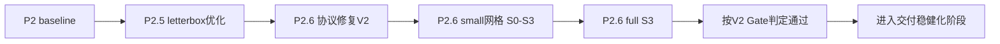
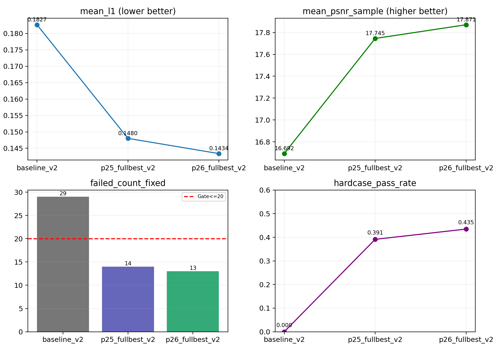
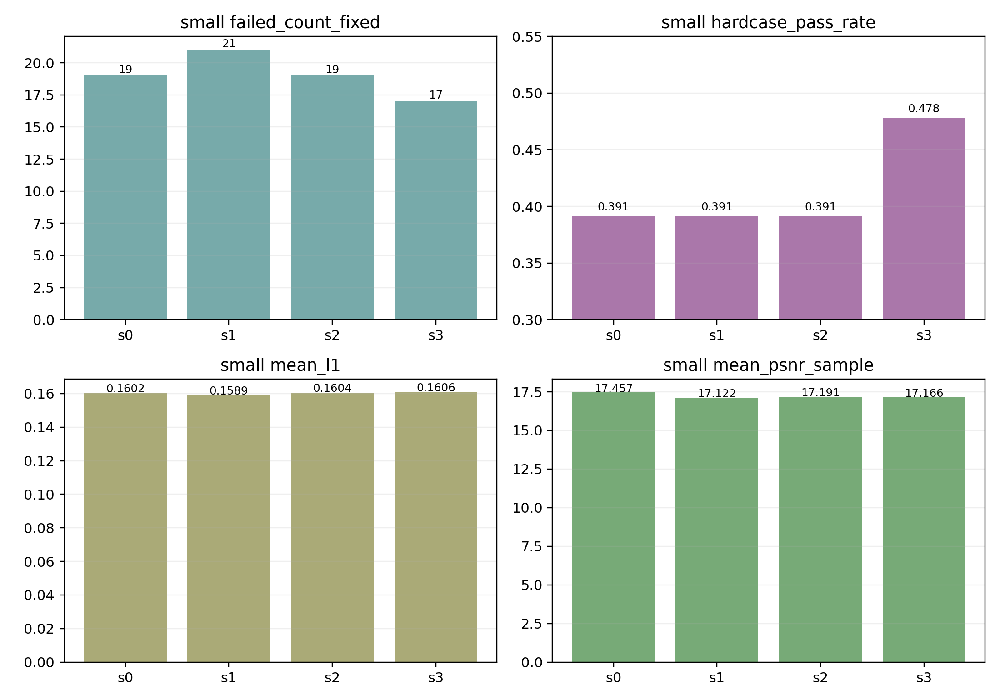
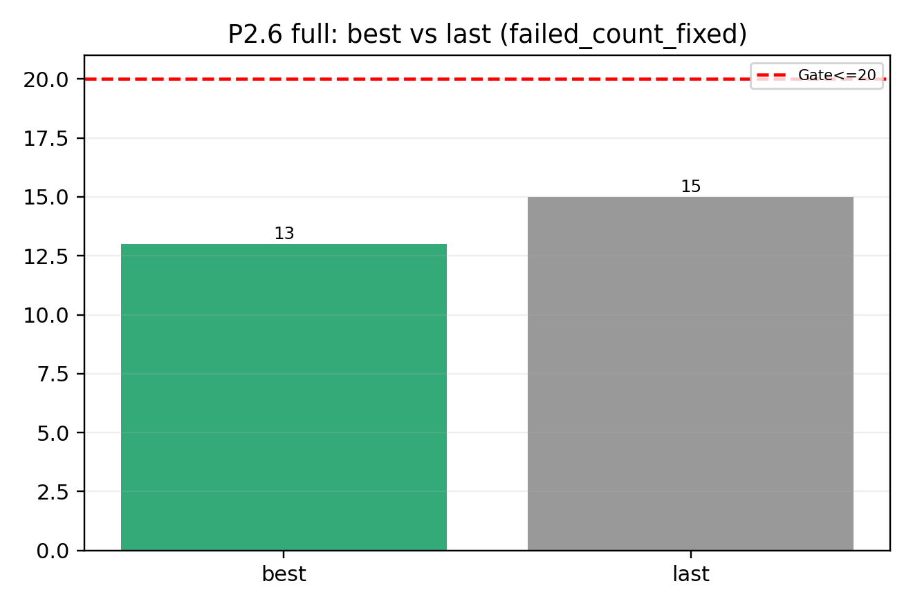
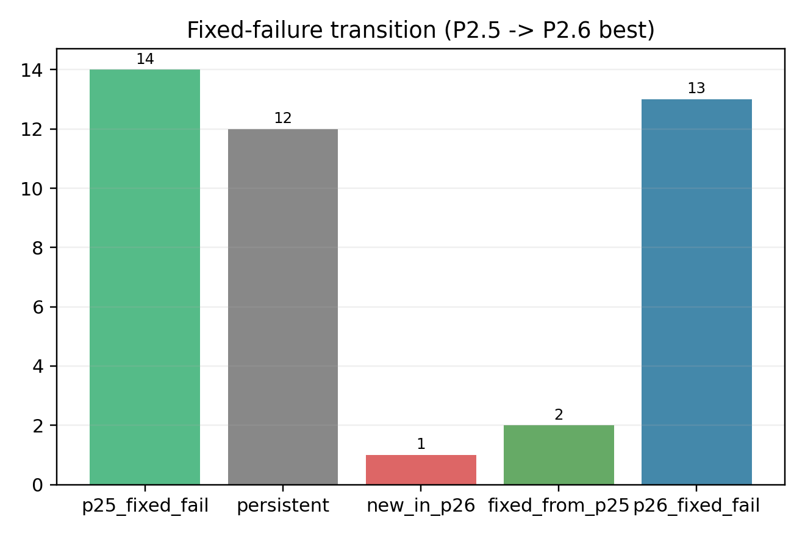
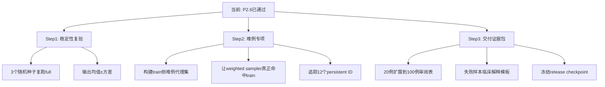

# P2.6 复盘总报告（教师指挥官视角）

> 位置：`/root/autodl-tmp/X/CodexDev/P26/P26.md`  
> 复核时间：2026-02-22  
> 结论先行：**你这轮 P2.6 是实质性进展，且按 V2 Gate 已通过**；但还不等于“可以无风险交付”，因为仍有 13 个 fixed 失败样本、hardcase 仍有 56.5% 未通过。

---

## 0. 我先做了“验收官式核对”（不是照单全收）

我已逐项核对以下关键文件，结论与执行 Codex 回报一致：

- 环境匹配：`/root/autodl-tmp/X/CodexDev/Execution_X_P1P2/docs/p26_env_check.md`
- 协议文档：`/root/autodl-tmp/X/CodexDev/Execution_X_P1P2/docs/eval_protocol_v2.md`
- V2复算报告：`/root/autodl-tmp/X/CodexDev/Execution_X_P1P2/docs/p26_reval_report.md`
- P2.6执行报告：`/root/autodl-tmp/X/CodexDev/Execution_X_P1P2/docs/p26_execution_report.md`
- full best指标：`/root/autodl-tmp/X/CodexDev/Execution_X_P1P2/outputs/p26/full/s3_best/val_metrics_v2_best.json`
- full best失败统计：`/root/autodl-tmp/X/CodexDev/Execution_X_P1P2/outputs/p26/full/s3_best/failure_stats_v2_best.json`

核对后确认：

- `mean_l1=0.143374`
- `mean_psnr_sample=17.870979`
- `failed_count_fixed=13`
- `hardcase_pass_rate=0.434783`

与您给出的最新返回一致。

---

## 1. 先把全局脉络讲清楚（你现在在哪个阶段）

你现在已经从“模型优化阶段”走到“**可交付候选阶段**”，重点从“单次跑赢”转成“稳定、可解释、可复现”。

---

## 2. P2.6 到底解决了什么核心矛盾

## 2.1 评估协议修复（这一步价值很大）

### 之前的问题

- PSNR 曾有两套口径（batch级 vs sample级），报告之间容易“看起来冲突”。
- failed_count 以前用 quantile 自参照规则，不适合跨实验公平比较。

### P2.6 的修复

- `validate_pix2pix.py` 同时输出：
  - `mean_psnr_sample`
  - `mean_psnr_batch`
  - 并指定 Gate 用 sample 口径
- `compute_failure_stats.py` 新增 fixed threshold 失败统计：
  - `failed_count_fixed`
  - `failed_ids_fixed`
  - `hardcase_pass_rate`

这意味着：**现在不同实验之间可以真正公平横向比较了。**

---

## 3. 结果怎么读：从 baseline -> P2.5 -> P2.6

### 核心数字（V2口径）

| 阶段 | mean_l1 | mean_psnr_sample | failed_count_fixed | hardcase_pass_rate |
|---|---:|---:|---:|---:|
| baseline_v2 | 0.182668 | 16.691880 | 29 | 0.0000 |
| p25_v2 | 0.148013 | 17.745494 | 14 | 0.3913 |
| p26_full_best_v2 | 0.143374 | 17.870979 | 13 | 0.4348 |

解释：

- 从 baseline 到 p25 是“跨台阶提升”；
- 从 p25 到 p26 是“继续压缩失败样本和hardcase失败率的精修提升”。

---

## 4. small 网格怎么理解（S0-S3）

- S3 被选中不是因为 L1/PSNR 全都最优，而是因为你定义的优先级是：
  1) `failed_count_fixed` 最低
  2) `hardcase_pass_rate` 最高
  3) 再看 L1

这符合“业务门槛优先”的思路，选择是合理的。

**但一个关键事实要讲清楚：**

- 训练日志显示 `hardcase_hits_in_train_subset=0`（small/full 都是 0）
- 说明你这轮 weighted sampler 机制已接入，但由于 hardcase 清单来自 val persistent IDs，和 train 子集不重合，**采样加权在本次几乎没有实际生效**。

=> 这轮改进主因更可能是：`edge loss(lambda_edge=2)` + best checkpoint 机制，而不是 hardcase sampler 本身。

---

## 5. full best vs last：为什么必须选 best

- best：`failed_count_fixed=13`，`hardcase_pass_rate=0.4348`
- last：`failed_count_fixed=15`，`hardcase_pass_rate=0.3478`

结论：

- 虽然 last 的 `mean_psnr_sample` 略高，但失败数和 hardcase 通过率更差；
- 你的“best按L1优先”在业务目标上是正确选择。

---

## 6. 失败样本迁移：哪些真的被修了，哪些还卡住

`failed_count_fixed`：14 -> 13，不是大幅下降，但结构有变化：

- 持续失败（12个）：`24,26,50,52,53,333,360,493,561,575,612,666`
- 修复（2个）：`15,692`
- 新增（1个）：`664`

这说明：

- P2.6 有净改善，但难例簇仍高度集中；
- 你下一步应该做“难例簇专项”，而不是盲目全量加epoch。

---

## 7. 图像结果怎么读（你现在看到的图，代表什么）

### full 关键拼图（建议重点看）

- P2.5 full best：`./graph/viz_p25_fullbest_grid20.png`
- P2.6 full best：`./graph/viz_p26_fullbest_grid20.png`
- P2.6 full last：`./graph/viz_p26_fulllast_grid20.png`
- 三者对照：`./graph/viz_compare_full_p25_p26.png`

### small 关键拼图

- S0：`./graph/viz_p26_small_s0_grid20.png`
- S3：`./graph/viz_p26_small_s3_grid20.png`
- 对照：`./graph/viz_compare_small_s0_s3.png`

### 如何正确理解这些图

1. 每张小图是 `输入照片 | 预测X光 | GT X光`。看中间与右侧差异。  
2. 这20例是固定抽样序列，不是 hardest 20。其中文件名可见仅包含 2 个 persistent hardcase（`613`,`347`）。  
3. 所以这些图主要用于“总体观感与明显伪影排查”，**不能单独证明 hardcase 全面过关**。  
4. hardcase 是否改善，必须结合 `failure_stats_v2_best.json` 的 hardcase统计看。

---

## 8. Gate 为什么说“通过”，这个“通过”有多强

### 按你当前 V2 Gate（固定阈值）

- `mean_l1 <= 0.170`：✅ 0.143374
- `mean_psnr_sample >= 17.0`：✅ 17.870979
- `failed_count_fixed <= 20`：✅ 13

所以**结论=通过**，这个结论成立。

### 但要补一句“教师式风险提示”

当前 fixed 阈值来自 baseline 分位阈值回填（历史基准），是工程上可比的一步，但还不是“临床终局阈值”。

换句话说：

- “通过”=通过你当前项目协议门槛；
- 不等于“临床零风险”；
- 下一阶段要做的是“通过后的稳健化与证据强化”。

---

## 9. 下一步怎么办（具体到执行层）

### 优先级建议（务实版）

1. **先做稳定性**：同配置跑 3 seeds（别改结构），确认不是一次性“幸运跑”。  
2. **再做难例专项**：把 val persistent 映射成 train 代理难例（按审计标签/形态分组），让 sampler 真正生效。  
3. **最后做交付包装**：输出可视化审核表 + 风险清单 + 冻结模型版本。

---

## 10. 一句话决策建议（给你接单用）

- 可以对外说：**“P2.6 在新评估协议下已达标通过，进入交付稳健化阶段。”**
- 不建议对外说：**“彻底解决所有难例。”**（当前还有 13 fixed fail，12 个 persistent 簇未击穿）

---

## 附：本报告新增图表资产

- `./graph/p26_stage_progress.png`
- `./graph/p26_small_grid_metrics.png`
- `./graph/p26_best_vs_last_failed.png`
- `./graph/p26_failure_transition_fixed.png`
- `./graph/p26_group_fixed_fail_rates.png`
- `./graph/viz_compare_full_p25_p26.png`
- `./graph/viz_compare_small_s0_s3.png`
- `./graph/p26_analysis_summary.json`
- `./graph/p26_failure_transition_ids.txt`

